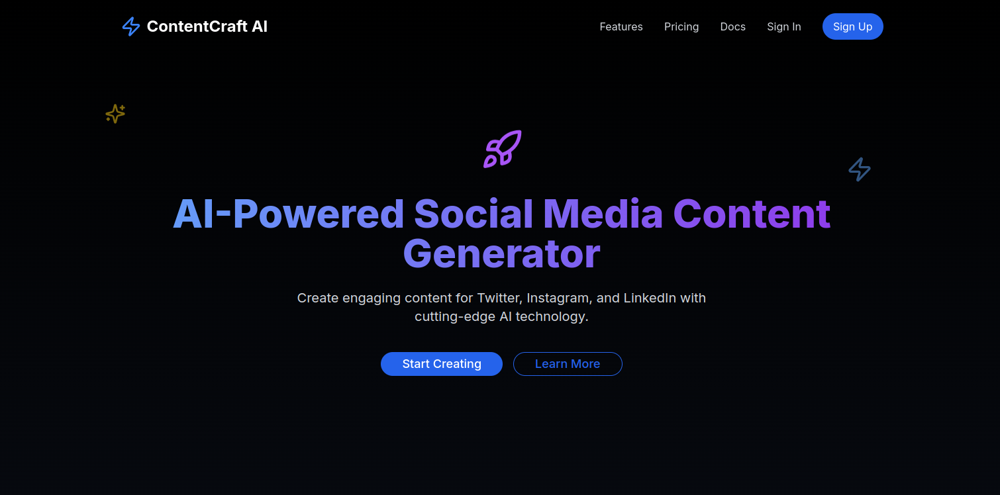
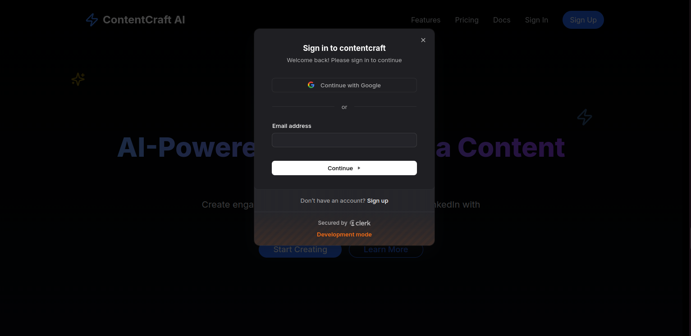
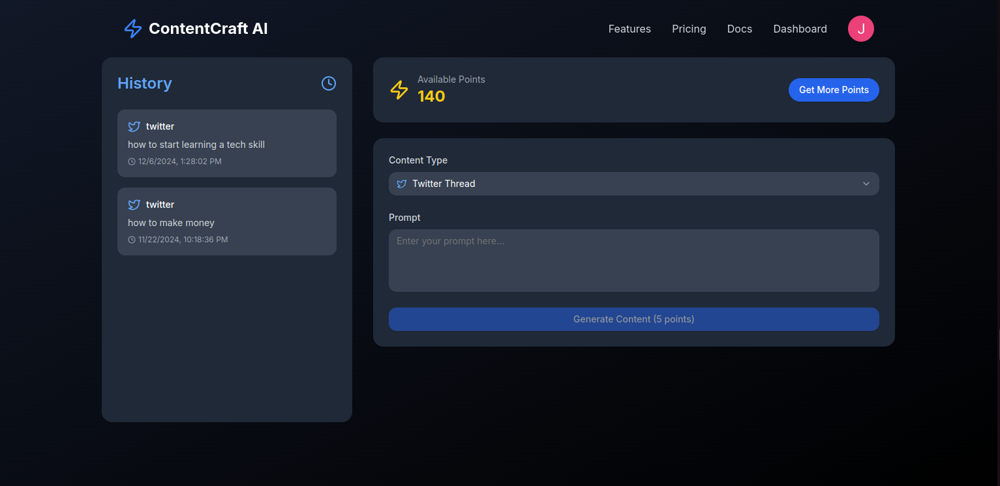
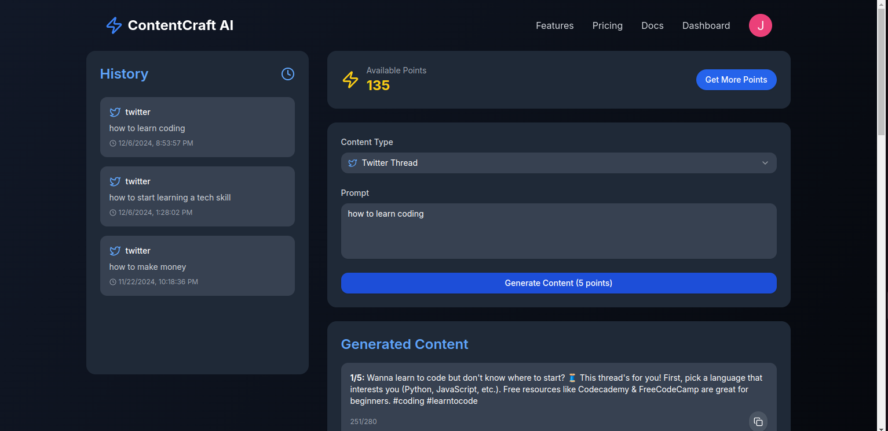
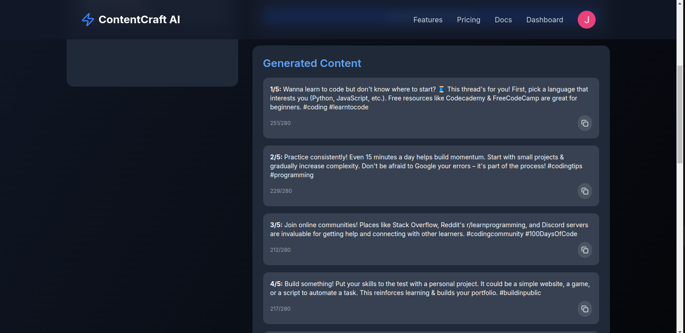
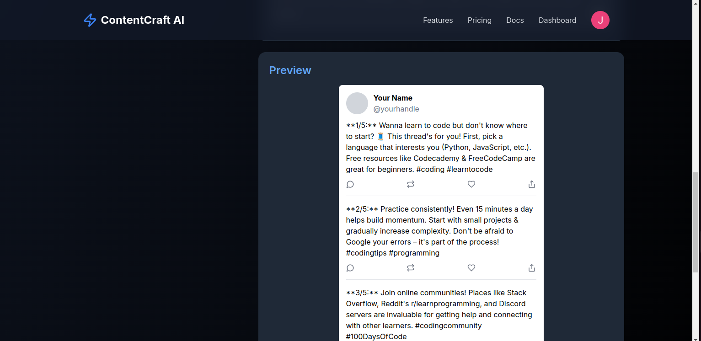

# ContentCraft-AI
This is a powerful SaaS platform designed to streamline content creation for X (formerly Twitter), LinkedIn, and Instagram. Using advanced AI technology, it generates high-quality, platform-specific posts, captions, and hashtags tailored to your audience. Whether you're an individual creator or a business, ContentCraft-AI ensures efficiency, consistency, and engagement by offering tools for customization, analytics, and scheduling, helping you maintain a compelling social media presence with ease. 















## Features:

##### - **User Authentication**: Implemented a robust and secure authentication system utilizing JWT and cookies to ensure safe login and registration processes.  
##### - **User Dashboard**: A dynamic and interactive user dashboard for managing content, tracking activities, and personalizing settings.  
##### - **User Activity History**: Users can access and view their historical data, including past interactions, content created, and engagement metrics, all through a seamless interface.    
##### - **Responsive Design**: Fully responsive layout, leveraging Material UI (MUI) to ensure optimal performance and user experience across a wide range of devices and screen sizes.  
##### - **shadcn UI Integration**: Utilized shadcn for a highly customizable, modern, and sleek UI design, ensuring consistency and smooth interaction.  
##### - **Welcome Email Automation**: Automated welcome emails sent to new users using Mailtrap, providing a personalized introduction and onboarding information upon account creation.  
##### - **Real-Time Data Updates**: Implemented real-time data sync across the platform, ensuring users always have the most up-to-date content and interaction status.  
##### - **Content Generation**: Automated content generation tools for creating engaging posts and updates tailored for multiple social media platforms.  


### Built With

Frameworks and tools that were used to develop ContentCraft.

* [![Next][Next.js]][Next-url]
* [![Typescript][Typescript.dev]][Typescript-url]
* [![Tailwind][Tailwind.com]][Tailwind-url]

<p align="right">(<a href="#readme-top">back to top</a>)</p>


<!-- GETTING STARTED -->
## Getting Started

Instructions on setting up your project locally.
To get a local copy up and running follow these simple example steps.

### Prerequisites

This is an example of how to list things you need to use the software and how to install them.
* npm
  ```sh
  npm install npm@latest -g
  ```

### Installation

1. Clone the repo
   ```sh
   https://github.com/JohnKamaujk/contentcraft.git
   ```
2. cd into the contentcraft folder
   ```sh
   cd contentcraft/
   ```
3. Install NPM packages
   ```sh
   npm install
   ```
4. Create a dot env file inside the frontend folder and set up env variables
   ```sh
      NEXT_PUBLIC_DATABASE_URL=
      NEXT_PUBLIC_BASE_URL=
      NEXT_PUBLIC_CLERK_PUBLISHABLE_KEY=
      CLERK_SECRET_KEY=
      MAILTRAP_API_TOKEN=
      NEXT_PUBLIC_STRIPE_PUBLISHABLE_KEY=
      STRIPE_SECRET_KEY=
      STRIPE_WEBHOOK_SECRET=
      NEXT_PUBLIC_GEMINI_API_KEY=
   ```
5. Then run the project on your browser
    ```sh
    npm run dev
    ```
<p align="right">(<a href="#readme-top">back to top</a>)</p>


<!-- MARKDOWN LINKS & IMAGES -->
<!-- https://www.markdownguide.org/basic-syntax/#reference-style-links -->
[Next.js]: https://img.shields.io/badge/next.js-000000?style=for-the-badge&logo=nextdotjs&logoColor=white
[Next-url]: https://nextjs.org/
[Typescript.dev]: https://img.shields.io/badge/Typescript-DD0031?style=for-the-badge&logo=typescript&logoColor=white
[Typescript-url]: https://www.typescriptlang.org/
[Tailwind.com]: https://img.shields.io/badge/Tailwind-563D7C?style=for-the-badge&logo=tailwind&logoColor=white
[Tailwind-url]: https://tailwindcss.com/


